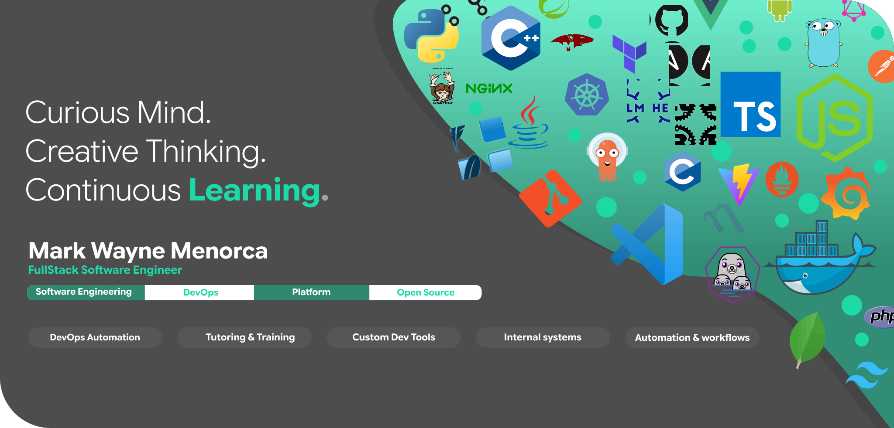

## <svg xmlns="http://www.w3.org/2000/svg" width="18" height="18" viewBox="0 0 24 24" fill="none" stroke="currentColor" stroke-width="1.8" stroke-linecap="round" stroke-linejoin="round" style="vertical-align:middle;margin-right:8px"><path d="M12 2l2.2 6.8L21 11l-6.8 2.2L12 20l-2.2-6.8L3 11l6.8-2.2L12 2z"/></svg>Open Source System Projects

Selected public projects—apps and systems built to solve real workflow pain. [See All Repositories →](https://github.com/marcuwynu23?tab=repositories)

- **[BiliBay](https://github.com/marcuwynu23/BiliBay)** — Filipino-inspired online marketplace connecting buyers and sellers through product listings, secure transactions, and a modern interface. Built to learn full-stack e-commerce end to end and serve as a reusable template for future commerce projects.
- **[GitShelf](https://github.com/marcuwynu23/gitshelf)** — Lightweight self-hosted source code management platform for creating, browsing, and managing repositories. Built to give teams a simple Git hosting option without relying on large platforms. Live demo: https://gitshelf.marcuwynu.space
- **[itemhive](https://github.com/marcuwynu23/itemhive)** — Inventory management system with stock tracking, financial visibility, and dynamic category management. Designed to help businesses organize products and monitor inventory clearly.
- **[apms](https://github.com/marcuwynu23/apms)** — Asset and property management system for tracking assets, assignments, maintenance, and role-based access. Built to replace scattered spreadsheets with a single management platform.
- **[txr](https://github.com/marcuwynu23/txr)** — Modern event ticketing platform for creating events, issuing QR tickets, and tracking attendance in real time. Designed to help organizers run events without a heavy ticketing stack.

---

## <svg xmlns="http://www.w3.org/2000/svg" width="18" height="18" viewBox="0 0 24 24" fill="none" stroke="currentColor" stroke-width="1.8" stroke-linecap="round" stroke-linejoin="round" style="vertical-align:middle;margin-right:8px"><path d="M12 2l2.2 6.8L21 11l-6.8 2.2L12 20l-2.2-6.8L3 11l6.8-2.2L12 2z"/></svg>Developer Tools

Reusable CLIs, libraries, and utilities for automation, security checks, deployments, and day-to-day developer work. [See All Repositories →](https://github.com/marcuwynu23?tab=repositories)

- **[Auto](https://github.com/marcuwynu23/Auto)** — Command-line workflow automation tool that runs each script step in its own terminal instance, making parallel and long-running jobs easier to manage. Official Website: https://auto.marcuwynu.space
- **[surisc](https://github.com/marcuwynu23/surisc)** — High-performance reconnaissance tool focused on frontend web security, helping teams discover frontend and API exposure earlier in the lifecycle.
- **[linea](https://github.com/marcuwynu23/linea)** — Cross-platform CLI for defining and running YAML-based command workflows consistently across machines. Official Website: https://linea.marcuwynu.space
- **[dan](https://github.com/marcuwynu23/danjs)** — Human-readable data format for configs, datasets, and annotations with tables, arrays, and comments. Designed for practical structured data workflows. Official Website: https://dan.marcuwynu.space
- **[jsdaffodil](https://github.com/marcuwynu23/jsdaffodil)** — Lightweight declarative deployment automation framework for Node.js, simplifying remote deployments with reusable workflows.
- **[treego](https://github.com/marcuwynu23/treego)** — CLI tool for printing directory trees and searching files directly from the terminal.
- **[webserve](https://github.com/marcuwynu23/webserve)** — Lightweight static file server for local development, enabling fast frontend previews and asset testing. Official Website: https://webserve.marcuwynu.space

---

## <svg xmlns="http://www.w3.org/2000/svg" width="18" height="18" viewBox="0 0 24 24" fill="none" stroke="currentColor" stroke-width="1.8" stroke-linecap="round" stroke-linejoin="round" style="vertical-align:middle;margin-right:8px"><path d="M3 21h18"/><path d="M5 21V7l7-4 7 4v14"/><path d="M9 9h6"/><path d="M9 13h6"/><path d="M9 17h6"/></svg>Organizations

Organizations I build and maintain to publish focused tools, libraries, and platform work.

- **mingledb** — File-based database tooling and related ecosystem projects. https://github.com/mingledb

---

## <svg xmlns="http://www.w3.org/2000/svg" width="18" height="18" viewBox="0 0 24 24" fill="none" stroke="currentColor" stroke-width="1.8" stroke-linecap="round" stroke-linejoin="round" style="vertical-align:middle;margin-right:8px"><path d="M12 2l2.2 6.8L21 11l-6.8 2.2L12 20l-2.2-6.8L3 11l6.8-2.2L12 2z"/></svg>DevOps Collections & Demonstrations

Infrastructure-as-Code collections and working examples for provisioning, monitoring, automation, and repeatable environments.

- **[docker-compose-collections](https://github.com/marcuwynu23/docker-compose-collections)** — Ready-to-use stacks for common infrastructure and development tooling to standardize setups quickly.
- **[ansible-collections](https://github.com/marcuwynu23/ansible-collections)** — Reusable playbooks for provisioning, securing, and maintaining consistent server environments.
- **[k8s-collections](https://github.com/marcuwynu23/k8s-collections)** — Kubernetes manifests for managing clusters, deploying apps, and scaling workloads.
- **[grafana-dashboard-collections](https://github.com/marcuwynu23/grafana-dashboard-collections)** — Pre-built dashboards for monitoring infrastructure, metrics, and system performance.
- **[terraform-proxmox-provisioning](https://github.com/marcuwynu23/terraform-proxmox-provisioning)** — Terraform examples for provisioning and managing virtual machines on Proxmox.
- **[artillery-collections](https://github.com/marcuwynu23/artillery-collections)** — Reusable Artillery scenarios for stress testing and performance validation across multiple logical groups.

---

## <svg xmlns="http://www.w3.org/2000/svg" width="18" height="18" viewBox="0 0 24 24" fill="none" stroke="currentColor" stroke-width="1.8" stroke-linecap="round" stroke-linejoin="round" style="vertical-align:middle;margin-right:8px"><path d="M12 2l2.2 6.8L21 11l-6.8 2.2L12 20l-2.2-6.8L3 11l6.8-2.2L12 2z"/></svg>Project Templates

Starter templates and boilerplates designed to remove repeated setup friction and help teams ship faster.

- **[wxPython-project-template](https://github.com/marcuwynu23/wxPython-project-template)** — Production-oriented desktop starter template using wxPython and uv.
- **[golang-web-mvc-project-template](https://github.com/marcuwynu23/golang-web-mvc-project-template)** — Starter template for Golang MVC web applications.
- **[cli-go-project-template](https://github.com/marcuwynu23/cli-go-project-template)** — Console application template for building Go CLIs with Cobra.
- **[cpp-cli-project-template](https://github.com/marcuwynu23/cpp-cli-project-template)** — Cross-platform C++ CLI template using CLI11 and vcpkg.
- **[cpp-gui-project-template](https://github.com/marcuwynu23/cpp-gui-project-template)** — Cross-platform C++ GUI template using Dear ImGui, GLFW, and vcpkg.
- **[monorepo-project-template](https://github.com/marcuwynu23/monorepo-project-template)** — Monorepo template using PNPM Workspaces and Turborepo with frontend, backend, and shared UI packages.
- **[flask-web-app-project-template](https://github.com/marcuwynu23/flask-web-app-project-template)** — Flask-based starter template for Python web applications.

---

## <svg xmlns="http://www.w3.org/2000/svg" width="18" height="18" viewBox="0 0 24 24" fill="none" stroke="currentColor" stroke-width="1.8" stroke-linecap="round" stroke-linejoin="round" style="vertical-align:middle;margin-right:8px"><path d="M12 2l2.2 6.8L21 11l-6.8 2.2L12 20l-2.2-6.8L3 11l6.8-2.2L12 2z"/></svg>Support

If my tools or templates saved you time, consider supporting maintenance:

For collaborations, questions, support, or business inquiries:

- **support@marcuwynu.space**
- **help@marcuwynu.space**
