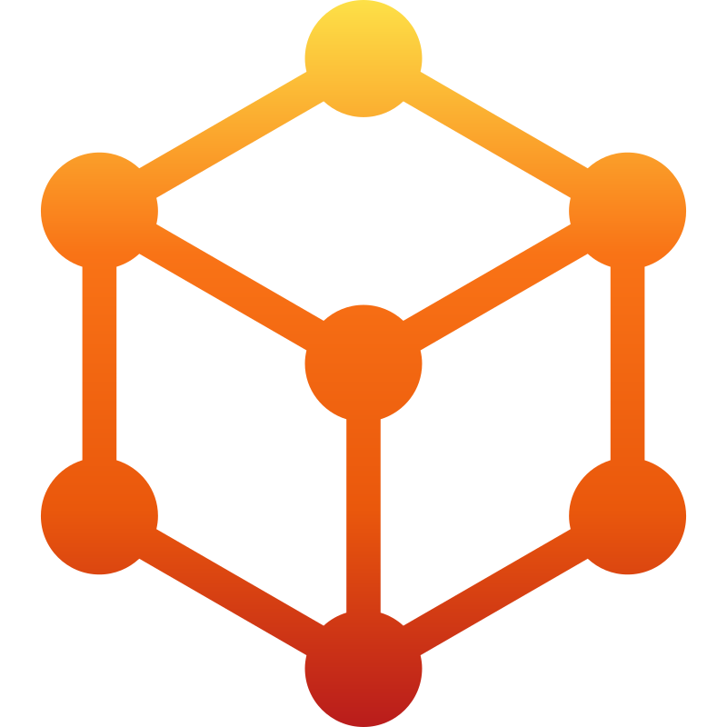

Hi! I'm **Mark Wayne Menorca** — a Fullstack Software Engineer focusing on **backend API**, **DevOps**, and **cloud infrastructure**. I love building **developer tools** and **developer platforms**. 6+ years in open source.

### Developer Tools

Tools I've built out of real problems I ran into — CLIs, libraries, and utilities for automation, security, and everyday dev work. Some started as side projects, others as solutions I wished existed. [See All →](https://github.com/marcuwynu23?tab=repositories)

|                                    Logo                                    | Description                                                                                                                                                                        | Official Website                 |
| :------------------------------------------------------------------------: | ---------------------------------------------------------------------------------------------------------------------------------------------------------------------------------- | -------------------------------- |
|          | [Auto](https://github.com/marcuwynu23/Auto) — Run script steps in parallel terminal windows.                                                                                       | https://auto.marcuwynu.space     |
|          | [surisc](https://github.com/marcuwynu23/surisc) — Scan frontend web apps for security issues.                                                                                      | https://surisc.marcuwynu.space   |
|  | [git-policy](https://github.com/marcuwynu23/git-policy) — Global Git rule and policy management. Install once, protect every repository.                                           |                                  |
|    | [sshtunnel](https://github.com/marcuwynu23/sshtunnel) Set up reverse SSH tunnels from a config file.                                                                               |                                  |
|                                                                            | [jsdaffodil](https://github.com/marcuwynu23/jsdaffodil) — Deploy Node.js apps with declarative workflows.                                                                          |                                  |
|        | [narciso](https://github.com/marcuwynu23/narciso) — Lightweight PHP web library. Routing, middleware, CORS, rate limiting, security headers, and database — no framework required. |                                  |
|   | [carabao.js](https://github.com/marcuwynu23/carabao.js) — Node.js MVC web framework. TypeScript-first, built on Express.                                                           | https://carabao.marcuwynu.space  |
|                                                                            | [just-utility](https://github.com/marcuwynu23/just-utility) — Windows CLI utility with built-in and 3rd party tools.                                                               |                                  |
|                                                                            | [webserve](https://github.com/marcuwynu23/webserve) — Static file server for local development.                                                                                    | https://webserve.marcuwynu.space |
|                                                                            | [git-community-standards](https://github.com/marcuwynu23/git-community-standards) — Apply community standard files to any GitHub repository.                                       |                                  |
|                                                                            | [git-remote-commits](https://github.com/marcuwynu23/git-remote-commits) — Live dashboard for monitoring Git commits.                                                               |                                  |
|                                                                            | [git-share](https://github.com/marcuwynu23/git-share) — Share commits and repos instantly.                                                                                         |                                  |
|            | [linea](https://github.com/marcuwynu23/linea) — Run command workflows defined in YAML.                                                                                             | https://linea.marcuwynu.space    |
|                                                                            | [likhis](https://github.com/marcuwynu23/likhis) — Auto-discover API routes and export to testing tools.                                                                            | https://likhis.marcuwynu.space   |
|                                                                            | [haribon](https://github.com/marcuwynu23/haribon) — Layer 7 load balancer written in Go with round-robin routing and health-aware balancing.                                       | https://haribon.marcuwynu.space  |
|                | [dan](https://github.com/marcuwynu23/danjs) — Human-readable data format for configs and datasets.                                                                                 | https://dan.marcuwynu.space      |
|                                                                            | [treego](https://github.com/marcuwynu23/treego) — Print directory trees and search files.                                                                                          |                                  |
|     | [GitShelf](https://github.com/marcuwynu23/gitshelf) — Self-hosted Git repository manager.                                                                                          | https://gitshelf.marcuwynu.space |
|      | [MingleDB](https://github.com/mingledb) — File-based database tooling ecosystem.                                                                                                   | https://mingledb.marcuwynu.space |
|        | [podfire](https://github.com/marcuwynu23/podfire) — Deploy GitHub repos as Dockerized apps.                                                                                        | https://podfire.marcuwynu.space  |

### Software Engineering Concepts

Concepts I wanted to truly understand, so I built projects around them — API types, caching, CAP theorem, data structures, and more.

- **[Project Demonstrations](https://github.com/marcuwynu23?tab=repositories&q=project-demonstration)** — Hands-on implementations of core software engineering concepts across different paradigms and technologies.

### DevOps Collections

Stacks and configs I've collected and refined from real deployments — provisioning, containerization, orchestration, monitoring, and automation.

- **[docker-compose-collections](https://github.com/marcuwynu23/docker-compose-collections)** — Ready-to-use Docker Compose stacks for common infrastructure and development tooling, designed to standardize local and server environments quickly without writing configs from scratch.

- **[terraform-module-collections](https://github.com/marcuwynu23?tab=repositories&q=terraform)** — Reusable Terraform modules for provisioning and managing infrastructure across providers, covering VM creation, networking, storage, and environment configuration to standardize infrastructure-as-code workflows.

- **[ansible-collections](https://github.com/marcuwynu23/ansible-collections)** — Reusable Ansible playbooks for provisioning, securing, and maintaining consistent server environments across multiple hosts and deployment targets.

- **[artillery-collections](https://github.com/marcuwynu23/artillery-collections)** — Reusable Artillery scenarios organized by logical groups for stress testing, load validation, and performance benchmarking across APIs and services.

- **[k8s-collections](https://github.com/marcuwynu23/k8s-collections)** — Kubernetes manifests for managing clusters, deploying applications, configuring services, and scaling workloads across environments.

- **[grafana-dashboard-collections](https://github.com/marcuwynu23/grafana-dashboard-collections)** — Pre-built Grafana dashboards for monitoring infrastructure metrics, system performance, and application health out of the box.

### System Projects

- **[System Projects](https://github.com/marcuwynu23?tab=repositories&q=%22system-project%22)** — Full apps and systems I built to scratch my own itch or solve real workflow pain.

### Project Templates

- **[Project Templates](https://github.com/marcuwynu23?tab=repositories&q=&type=template)** — Boilerplates I wish I had when starting projects. Removes the setup friction so you can ship faster.

#### Support & Ask for help

If you like my concepts and ideas, I'm open for donations to support my cause and if you want to ask something. Every contribution helps me build more open-source projects and share knowledge.

