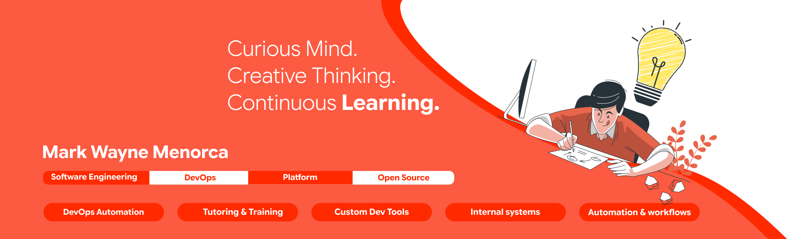
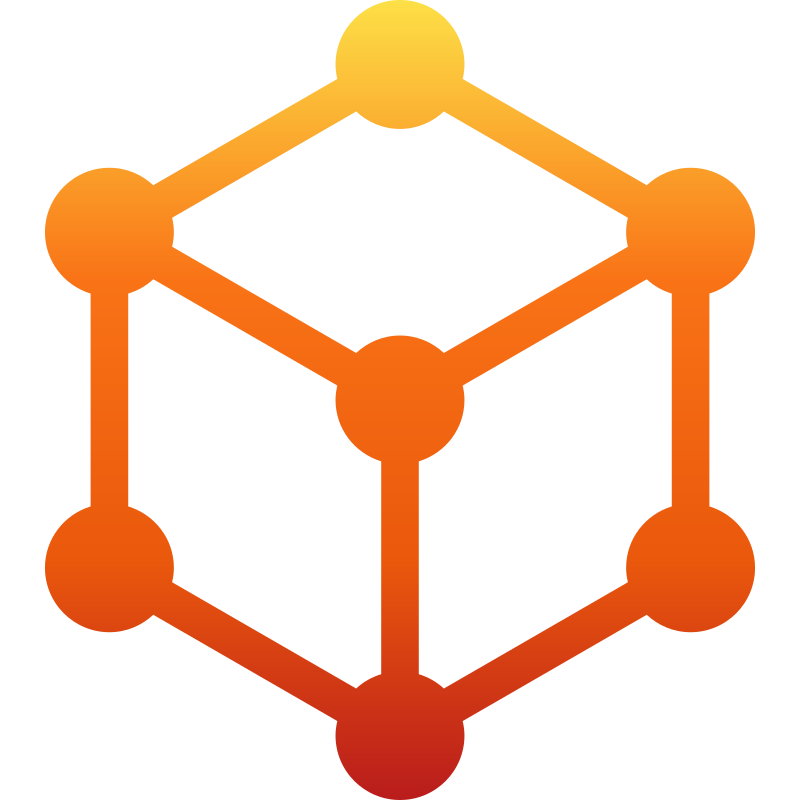

Hi! I'm **Mark Wayne Menorca** — a DevOps Engineer with a background in Software Engineering. I build **developer tools** and **developer platforms**, and I maintain open-source projects around automation, security, and everyday dev workflows. 7 years of open-source work solving real problems and deeply understanding concepts — now also open for freelance DevOps engagements with startups and teams.

---

### Developer Tools

Tools I've built out of real problems I ran into — CLIs, libraries, and utilities for automation, security, and everyday dev work. Some started as side projects, others as solutions I wished existed. [See All →](https://github.com/marcuwynu23?tab=repositories)

<table>
  <thead>
    <tr>
      <th>Logo</th>
      <th>Description</th>
      <th colspan="2">Version</th>
      <th>Official Website</th>
    </tr>
    <tr>
      <th></th>
      <th></th>
      <th>Latest</th>
      <th>Stable</th>
      <th></th>
    </tr>
  </thead>
  <tbody>
    <tr>
      <td align="center"></td>
      <td><a href="https://github.com/marcuwynu23/Auto">Auto</a> — Run script steps in parallel terminal windows.</td>
      <td>v2.1.1</td>
      <td>v2.1.1</td>
      <td><a href="https://auto.marcuwynu.space">https://auto.marcuwynu.space</a></td>
    </tr>
    <tr>
      <td align="center"></td>
      <td><a href="https://github.com/marcuwynu23/surisc">surisc</a> — Scan frontend web apps for security issues.</td>
      <td>v2.3.0</td>
      <td>v2.3.0</td>
      <td><a href="https://surisc.marcuwynu.space">https://surisc.marcuwynu.space</a></td>
    </tr>
    <tr>
      <td align="center"></td>
      <td><a href="https://github.com/marcuwynu23/git-policy">git-policy</a> — Global Git rule and policy management. Install once, protect every repository.</td>
      <td>v1.1.0</td>
      <td>v1.1.0</td>
      <td></td>
    </tr>
    <tr>
      <td align="center"></td>
      <td><a href="https://github.com/marcuwynu23/sshtunnel">sshtunnel</a> — Set up reverse SSH tunnels from a config file.</td>
      <td>v1.1.0</td>
      <td>v1.1.0</td>
      <td></td>
    </tr>
    <tr>
      <td align="center"></td>
      <td><a href="https://github.com/marcuwynu23/jsdaffodil">jsdaffodil</a> — Cross-Platform Deployment Automation Framework for Node.js.</td>
      <td>v2.1.0</td>
      <td>v2.1.0</td>
      <td></td>
    </tr>
    <tr>
      <td align="center"></td>
      <td><a href="https://github.com/marcuwynu23/godaffodil">godaffodil</a> — Cross-Platform Deployment Automation Framework for Go.</td>
      <td>v1.0.0</td>
      <td>v1.0.0</td>
      <td></td>
    </tr>
    <tr>
      <td align="center"></td>
      <td><a href="https://github.com/marcuwynu23/pydaffodil">pydaffodil</a> — Cross-Platform Deployment Automation Framework for Python.</td>
      <td>v1.2.1</td>
      <td>v1.2.1</td>
      <td></td>
    </tr>
    <tr>
      <td align="center"></td>
      <td><a href="https://github.com/marcuwynu23/narciso">narciso</a> — Lightweight PHP web library. Routing, middleware, CORS, rate limiting, security headers, and database — no framework required.</td>
      <td>v1.0.2</td>
      <td>v1.0.2</td>
      <td></td>
    </tr>
    <tr>
      <td align="center"></td>
      <td><a href="https://github.com/marcuwynu23/carabao.js">carabao.js</a> — Node.js MVC web framework. TypeScript-first, built on Express.</td>
      <td>v1.1.5</td>
      <td>v1.1.5</td>
      <td><a href="https://carabao.marcuwynu.space">https://carabao.marcuwynu.space</a></td>
    </tr>
    <tr>
      <td align="center"></td>
      <td><a href="https://github.com/marcuwynu23/just-utility">just-utility</a> — Windows CLI utility with built-in and 3rd party tools.</td>
      <td>v0.2.0</td>
      <td>v0.2.0</td>
      <td></td>
    </tr>
    <tr>
      <td align="center"></td>
      <td><a href="https://github.com/marcuwynu23/webserve">webserve</a> — Static file server for local development.</td>
      <td>v1.3.0</td>
      <td>v1.3.0</td>
      <td><a href="https://webserve.marcuwynu.space">https://webserve.marcuwynu.space</a></td>
    </tr>
    <tr>
      <td align="center"></td>
      <td><a href="https://github.com/marcuwynu23/git-community-standards">git-community-standards</a> — Apply community standard files to any Git repository (GitHub, GitLab, Bitbucket).</td>
      <td>v1.1.1</td>
      <td>v1.1.1</td>
      <td></td>
    </tr>
    <tr>
      <td align="center"></td>
      <td><a href="https://github.com/marcuwynu23/git-remote-commits">git-remote-commits</a> — Live dashboard for monitoring Git commits.</td>
      <td>v2.1.4</td>
      <td>v2.1.4</td>
      <td></td>
    </tr>
    <tr>
      <td align="center"></td>
      <td><a href="https://github.com/marcuwynu23/git-share">git-share</a> — Share commits and repos instantly.</td>
      <td>v1.0.0</td>
      <td>v1.0.0</td>
      <td></td>
    </tr>
    <tr>
      <td align="center"></td>
      <td><a href="https://github.com/marcuwynu23/linea">linea</a> — Run command workflows defined in YAML.</td>
      <td>v1.0.0</td>
      <td>v1.0.0</td>
      <td><a href="https://linea.marcuwynu.space">https://linea.marcuwynu.space</a></td>
    </tr>
    <tr>
      <td align="center"></td>
      <td><a href="https://github.com/marcuwynu23/likhis">likhis</a> — Auto-discover API routes and export to testing tools.</td>
      <td>v1.1.0</td>
      <td>v1.1.0</td>
      <td><a href="https://likhis.marcuwynu.space">https://likhis.marcuwynu.space</a></td>
    </tr>
    <tr>
      <td align="center"></td>
      <td><a href="https://github.com/marcuwynu23/haribon">haribon</a> — Layer 7 load balancer written in Go with round-robin routing and health-aware balancing.</td>
      <td>v1.3.0</td>
      <td>v1.3.0</td>
      <td><a href="https://haribon.marcuwynu.space">https://haribon.marcuwynu.space</a></td>
    </tr>
    <tr>
      <td align="center"></td>
      <td><a href="https://github.com/marcuwynu23/danjs">dan</a> — Human-readable data format for configs and datasets.</td>
      <td>v1.0.0</td>
      <td>v1.0.0</td>
      <td><a href="https://dan.marcuwynu.space">https://dan.marcuwynu.space</a></td>
    </tr>
    <tr>
      <td align="center"></td>
      <td><a href="https://github.com/marcuwynu23/treego">treego</a> — Print directory trees and search files.</td>
      <td>v1.1.2</td>
      <td>v1.1.2</td>
      <td></td>
    </tr>
    <tr>
      <td align="center"></td>
      <td><a href="https://github.com/marcuwynu23/dataflute">dataflute</a> — Expose local data files as read-only REST APIs.</td>
      <td>v1.0.0</td>
      <td>v1.0.0</td>
      <td></td>
    </tr>
    <tr>
      <td align="center"></td>
      <td><a href="https://github.com/marcuwynu23/gitshelf">GitShelf</a> — Self-hosted Git repository manager.</td>
      <td></td>
      <td></td>
      <td><a href="https://gitshelf.marcuwynu.space">https://gitshelf.marcuwynu.space</a></td>
    </tr>
    <tr>
      <td align="center"></td>
      <td><a href="https://github.com/mingledb">MingleDB</a> — File-based database tooling ecosystem.</td>
      <td>v1.2.0</td>
      <td>v1.2.0</td>
      <td><a href="https://mingledb.marcuwynu.space">https://mingledb.marcuwynu.space</a></td>
    </tr>
    <tr>
      <td align="center"></td>
      <td><a href="https://github.com/marcuwynu23/podfire">podfire</a> — Deploy GitHub repos as Dockerized apps.</td>
      <td></td>
      <td></td>
      <td><a href="https://podfire.marcuwynu.space">https://podfire.marcuwynu.space</a></td>
    </tr>
    <tr>
      <td align="center"></td>
      <td><a href="https://github.com/marcuwynu23/envious">envious</a> — Self-hosted environment variable manager with versioning, audit trail, dashboard, and CLI.</td>
      <td>v2.0.0</td>
      <td>v1.0.0</td>
      <td><a href="https://marcuwynu23.github.io/envious">https://marcuwynu23.github.io/envious</a></td>
    </tr>
  </tbody>
</table>

---

### Software Engineering Concepts

Concepts I wanted to truly understand, so I built projects around them — API types, caching, CAP theorem, data structures, and more.

- **[Project Demonstrations](https://github.com/marcuwynu23?tab=repositories&q=project-demonstration)** — Hands-on implementations of core software engineering concepts across different paradigms and technologies.

### DevOps Collections

Stacks and configs I've collected and refined from real deployments — provisioning, containerization, orchestration, monitoring, and automation.

- **[docker-compose-collections](https://github.com/marcuwynu23/docker-compose-collections)** — Ready-to-use Docker Compose stacks for common infrastructure and development tooling, designed to standardize local and server environments quickly without writing configs from scratch.

- **[terraform-module-collections](https://github.com/marcuwynu23?tab=repositories&q=terraform)** — Reusable Terraform modules for provisioning and managing infrastructure across providers, covering VM creation, networking, storage, and environment configuration to standardize infrastructure-as-code workflows.

- **[crossplane-collections](https://github.com/marcuwynu23?tab=repositories&q=crossplane)** — Reusable Crossplane compositions, functions, and providers for provisioning and managing cloud infrastructure declaratively via Kubernetes CRDs, standardizing cloud-native control plane workflows.

- **[ansible-collections](https://github.com/marcuwynu23/ansible-collections)** — Reusable Ansible playbooks for provisioning, securing, and maintaining consistent server environments across multiple hosts and deployment targets.

- **[artillery-collections](https://github.com/marcuwynu23/artillery-collections)** — Reusable Artillery scenarios organized by logical groups for stress testing, load validation, and performance benchmarking across APIs and services.

- **[kubernetes-collections](https://github.com/marcuwynu23/kubernetes-collections)** — Kubernetes manifests for managing clusters, deploying applications, configuring services, and scaling workloads across environments.

- **[grafana-dashboard-collections](https://github.com/marcuwynu23/grafana-dashboard-collections)** — Pre-built Grafana dashboards for monitoring infrastructure metrics, system performance, and application health out of the box.

- **[system-service-collections](https://github.com/marcuwynu23/system-service-collections)** — Ready-to-use system service definitions for popular services, supporting multiple init systems (systemd, OpenRC, SysVinit, Windows NSSM).

---

### System Projects

- **[System Projects](https://github.com/marcuwynu23?tab=repositories&q=%22system-project%22)** — Full apps and systems I built to scratch my own itch or solve real workflow pain.

---

### Project Templates

- **[Project Templates](https://github.com/marcuwynu23?tab=repositories&q=&type=template)** — Boilerplates I wish I had when starting projects. Removes the setup friction so you can ship faster.

---

### Services & Support

If you find my open-source work useful, donations help me keep building and sharing knowledge. For work inquiries, contact is via email only:

- **Project support** — help with my open-source projects
- **Tool questions** — usage and troubleshooting for my tools
- **Ideas & collaboration** — genuine collaboration proposals welcome
- **Freelance / Startup support** — DevOps automation: CI/CD, resource provisioning, and tool/CLI building

> **Before emailing:** please use a clear subject such as `[Support] ...` or `[Inquiry] ...`, briefly introduce yourself, and describe the project and what you need. I don't monitor the spam folder, so a plain-text first email without bulk attachments/links helps ensure I see it. If there's no reply in 3–5 days, please resend — your first email may have been filtered.

  

Follow me:

 
